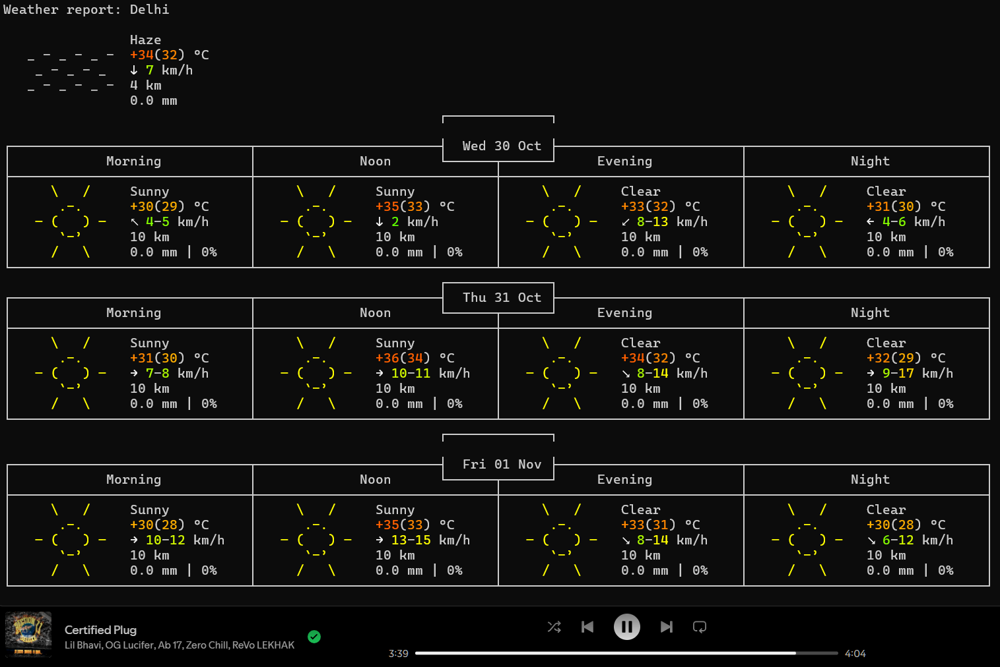

# QuickWeather ☁️

QuickWeather is a simple batch script for quickly checking the current weather of any location directly from the command line. It uses wttr.in to fetch real-time weather data and display it in a clean, readable format.

In the batch file just change the name of _city_ to chnage the output!

## Features ✨

Quick and Simple 
> Just run the script to get instant weather information.

No Browser Needed 
> View weather right in the terminal.

Easily Customizable  
>  Update the location in the script for your preferred city.
Requirements``


## Installation 🔧

Clone this repository to your local machine:

```bash
git clone https://github.com/ShiiiivanshSingh/QuickWeather
```
Navigate to the repository folder:
```bash
cd QuickWeather
```
--- 

## Example Output:


---
Thanks<br> -Shivansh
